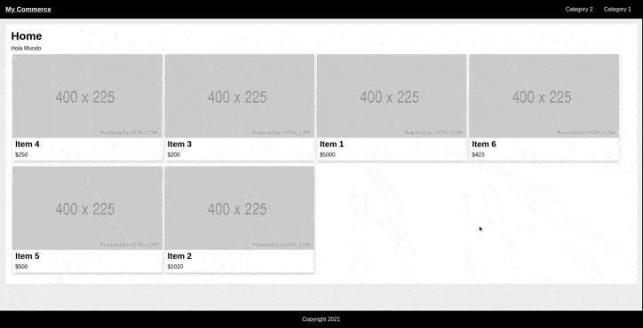

# My Commerce

[CoderHouse](https://www.coderhouse.com/) React.js course final project.

## Demo

## Installation

Clone this repository and use `npm install` to get all its dependencies.

## Available Scripts

In the project directory, you can run:

### `npm start`

Runs the app in the development mode.\
Open [http://localhost:3000](http://localhost:3000) to view it in the browser.

The page will reload if you make edits.\
You will also see any lint errors in the console.

### `npm test`

Launches the test runner in the interactive watch mode.\

### `npm run build`

Builds the app for production to the `build` folder.\
It correctly bundles React in production mode and optimizes the build for the best performance.

## Conventions

### Naming

Components and Contexts are defined in PascalCase (UpperCamelCase).\
Services are defined in camelCase (lowerCamelCase).

### Folders

- **public**\
  Contains `index.html` and public resources.
- **src**\
  Contains source code of the project.
  - **root**\
    Contains front controller and `App.js`.
  - **components**\
    Contains UI Components.
  - **context**\
    Contains application contexts.
  - **services**\
    Contains data querying scripts.

### Coding

- Code CAN use ES6(ES2015) features. 
- UI Components MUST be defined as functional components and use hooks.
- UI Components MUST NOT contain logic beyond presentation. 
- UI Components MUST be tested.
- UI Components SHOULD be tested in isolation of other components.
- UI Components SHOULD mock services call.
- Libraries SHOULD be imported before Contexts, Contexts SHOULD be imported before Components, Components SHOULD be
imported before Styles.
- UI Components SHOULD use promises.
- Contexts MUST be defined as functional components.
- Contexts MUST be responsible for its data.
- Contexts functions SHOULD be declared as const.
- Services MUST be declared as arrow functions.
- Services MUST use async / await over Promises.
